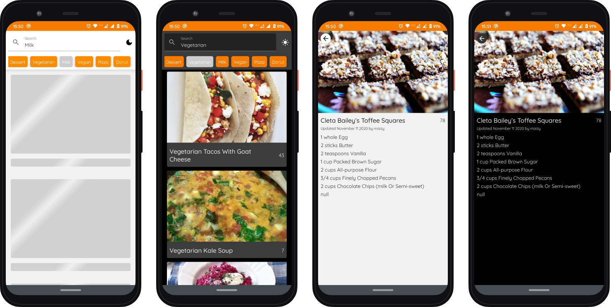

 

  <h3 align="center">Cook Book</h3>

  <a href="#o-projeto">O Projeto</a>&nbsp;&nbsp;&nbsp;|&nbsp;&nbsp;&nbsp;
  <a href="#tecnologias">Tecnologias</a>&nbsp;&nbsp;&nbsp;|&nbsp;&nbsp;&nbsp;
  <a href="#%EF%B8%8Ffetures">Features</a>

  

  

 

## 🌱O Projeto

Um app de recitas que utiliza a api [food2fork](https://food2fork.ca/), permite consultar diversas receitas e suas listas de ingredientes, utilizando o campo de busca ou selecionando uma das categorias.

## 🚀Tecnologias
Esse projeto utiliza as seguintes tecnologias :

* <b><a href="https://developer.android.com/jetpack/compose">Jetpack Compose</a></b> - É utilizado em todas as telas para construir a UI, e o sistema de temas.
* <b><a href="https://dagger.dev/hilt/">Hilt(Dagger2)</a></b> - Utilizada como lib de injeção de dependencias.
* <b><a href="https://developer.android.com/kotlin/ktx">KTX/a></b> - Extensões Kotlin permitem escrever um código mais idiomático.
* <b><a href="https://developer.android.com/guide/navigation/navigation-getting-started">Jetpack Navigation</a></b> - Utilizada para navegação.
* <b><a href="https://github.com/bumptech/glide">Glide 4</a></b> - Utilizada para fazer o carregamento das imagens de maneira asyncrona e o caching.
* <b><a href="https://developer.android.com/jetpack/androidx/releases/lifecycle#declaring_dependencies">Lifecycle Components</a></b> - Os components necessários pra minha arquitetura MVVM, ViewModel e LiveData.

## 🗺️Fetures
O app contem as seguintes features:

* Busca de receitas por nome ou ingrediente.
* Seleção de categorias pré definidas.
* Temas claro e tema escuro.
* Scroll infinito
* Detalhes da receita com ingredientes.

---

Feito com ♥ por <b><a href="https://github.com/Drawiin">Drawiin</a></b> 👋
